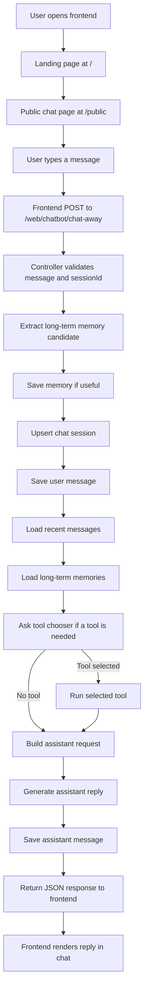

# sunny-claws

sunny-claws is a full-stack chatbot project with a custom assistant persona, a Node/Express backend, MongoDB persistence, and a Next.js frontend. In its current state, the project already supports end-to-end chat requests, stores conversations by session, keeps a simple long-term memory per session, and can optionally call small utility tools before generating a reply.

This README describes what the project is right now, how the pieces flow together, and what each file is responsible for. It intentionally avoids secret configuration details and does not document provider-specific private setup values.

## Current Project Status

The project currently includes:

- A backend API that accepts chat messages and returns assistant replies.
- MongoDB models for chat messages, chat sessions, and long-term memory.
- A memory pipeline that extracts durable facts from user messages and stores them by session.
- A tool-selection step that can decide whether a request should use a utility tool.
- Two active tools: calculator and weather.
- A Next.js frontend with a landing page, a public chat page, and a shared navigation bar.

The project also has some work-in-progress areas:

- A `private` frontend area exists as an empty folder and is not wired up yet.
- A profile link and logout action are present in the UI, but the related app flow is not implemented.
- A web search tool file exists, but it is not registered in the tool registry, so it is not used.
- There are two backend message model files that define the same message schema.

## High-Level Architecture

The app is split into two main parts:

- `Backend/`: Express server, database connection, routing, controller logic, memory handling, tool execution, and assistant reply generation.
- `Frontend/claws/`: Next.js app that renders the UI and sends chat messages to the backend.

At a high level, the frontend sends a message to the backend, the backend saves context, optionally runs a tool, builds a prompt using recent chat plus saved memory, generates a reply, stores the reply, and returns it to the UI.

## Workflow Diagram



## Request Flow From Top To Bottom

### 1. Frontend entry

The user lands on `/` and is taken into the app by navigating to `/public`. The public page owns the chat UI, local message list, active session ID, and the fetch call to the backend.

### 2. Backend route

The frontend sends a POST request to `/web/chatbot/chat-away`. That route is mounted by the Express server and forwarded to the chatbot controller.

### 3. Validation and session setup

The controller checks that the request contains a non-empty message. It also creates or reuses a session ID so all stored messages and memories can be grouped together.

### 4. Memory extraction

Before generating a response, the backend tries to extract a durable fact from the incoming user message. If the message contains something worth remembering, that memory is stored in MongoDB under the current session.

### 5. Chat history storage

The backend stores the incoming user message as a chat record. It also creates the chat session document if this is the first message for that session.

### 6. Context building

The backend fetches the most recent chat messages for short-term context and fetches stored memory entries for long-term context. These two sources are combined into one memory block.

### 7. Tool decision

The backend asks its tool-selection layer whether the user message needs an external helper. Right now that means simple math or weather lookups.

### 8. Tool execution

If a tool is selected, the tool service looks it up in the registry and runs it. The tool output is then included with the final assistant request.

### 9. Assistant reply generation

The backend generates the assistant response using the configured assistant persona, the current user message, the recent chat context, the stored memory context, and any tool output.

### 10. Persistence and response

The assistant reply is saved to the database and returned to the frontend as JSON. The frontend then appends that reply to the visible message thread.

## Project Structure

```text
sunny-claws/
├── Backend/
│   ├── config/
│   ├── controllers/
│   ├── models/
│   ├── routes/
│   ├── services/
│   ├── tools/
│   ├── package.json
│   └── server.js
├── Frontend/
│   └── claws/
│       ├── src/app/
│       ├── src/components/
│       └── package.json
└── README.md
```

## File-By-File Explanation

### Root

#### `README.md`

- What it is: the project-level documentation file.
- How it is used: explains the app structure, request flow, and current implementation state.
- Why it exists: to make the codebase understandable without tracing every file manually.

## Backend

### `Backend/server.js`

- What it does: starts the Express app, enables JSON parsing and CORS, defines a basic hello route, mounts the chatbot router, connects to MongoDB, and starts listening on the backend port.
- Where it sits in the flow: this is the backend entry point and the first server file that runs.
- Why it exists: it assembles the application and controls startup.

### `Backend/package.json`

- What it does: defines backend dependencies such as Express, MongoDB integration, environment loading, and the OpenAI SDK.
- Where it sits in the flow: it supports installation and runtime for the backend app.
- Why it exists: Node projects need dependency and script metadata here.

### `Backend/config/agentSoul.js`

- What it does: stores the assistant persona text used when generating replies.
- How it works: exports a reusable string that is inserted as the system prompt for the assistant.
- Why it exists: keeping the persona separate makes it easier to tune behavior without mixing prompt text into controller logic.

### `Backend/config/mongoDB.js`

- What it does: creates the MongoDB connection function.
- How it works: reads local runtime configuration, validates that the database connection string exists, and opens a Mongoose connection.
- Why it exists: database bootstrapping should be isolated from route and controller logic.

### `Backend/controllers/chatbotController.js`

- What it does: handles chat requests and session-list requests.
- How it works: validates input, extracts memory, saves memory, upserts sessions, stores chat messages, loads recent context, chooses tools, generates replies, stores assistant output, and returns JSON.
- Why it exists: controllers hold request-specific orchestration so the route layer stays thin.

### `Backend/routes/chatbotRouter.js`

- What it does: defines the chatbot-related HTTP endpoints.
- How it works: maps `POST /chat-away` to the reply flow and `GET /sessions` to session retrieval.
- Why it exists: routes should declare endpoint structure without containing the business logic themselves.

### `Backend/models/chatSessionModel.js`

- What it does: defines the schema for chat sessions.
- How it works: stores a unique session ID, a title, and automatic timestamps.
- Why it exists: sessions let the backend group messages and memories into separate conversations.

### `Backend/models/memoryModel.js`

- What it does: defines the schema for long-term remembered facts.
- How it works: stores a memory string tied to a session ID, plus timestamps.
- Why it exists: this gives the assistant a persistent memory layer beyond the latest messages.

### `Backend/models/chatbotModel.js`

- What it does: defines the schema for individual chat messages.
- How it works: stores session ID, sender role, message text, and timestamps.
- Why it exists: this is the model currently imported by the controller for chat persistence.

### `Backend/models/chatbotMessageModel.js`

- What it does: defines the same chat message schema as `chatbotModel.js`.
- How it works: creates the same `ChatbotMessage` model structure.
- Why it exists: right now it appears to be a duplicate file rather than a separate model.

### `Backend/services/openaiService.js`

- What it does: handles assistant reply generation and tool-selection decisions.
- How it works: lazily creates a client when AI credentials are available, falls back gracefully when they are not, asks one AI step whether a tool is needed, and asks another AI step to generate the final reply.
- Why it exists: AI-specific logic is easier to maintain and swap when it is isolated from controller code.

### `Backend/services/memoryService.js`

- What it does: extracts memories, saves memories, and returns stored memories for a session.
- How it works: asks the AI layer to convert a user message into a durable memory when appropriate, writes saved memories to MongoDB, and formats stored memories into a prompt-friendly list.
- Why it exists: memory behavior is a distinct concern and should not be embedded directly inside the controller.

### `Backend/services/toolService.js`

- What it does: runs a named tool selected by the system.
- How it works: looks up the tool in the registry and executes it with the provided input.
- Why it exists: tool execution needs one simple layer between controller logic and individual tool implementations.

### `Backend/tools/toolRegistry.js`

- What it does: lists the tools that are actually available to the app.
- How it works: exports a single array of tool names, descriptions, and execute handlers.
- Why it exists: a central registry makes tool discovery and tool-choice prompting consistent.

### `Backend/tools/calculatorTool.js`

- What it does: evaluates simple math expressions.
- How it works: strips unsupported characters, evaluates the remaining expression, and returns the result as text.
- Why it exists: some user requests are better answered through deterministic calculation than free-form reasoning.

### `Backend/tools/weatherTool.js`

- What it does: looks up the current weather for a city.
- How it works: uses a geocoding request to find the place and a weather request to fetch current temperature and wind speed.
- Why it exists: weather is a concrete example of tool-augmented answers.

### `Backend/tools/webSearchTool.js`

- What it does: contains a placeholder web-search function.
- How it works: returns a stub message instead of calling a real search provider.
- Why it exists: it looks like a future extension point, but it is not active in the current registry.

## Frontend

### `Frontend/claws/package.json`

- What it does: defines the frontend runtime, build, and lint dependencies.
- How it works: uses Next.js as the app framework, React for UI, and Tailwind for styling.
- Why it exists: it is the package definition for the frontend app.

### `Frontend/claws/next.config.mjs`

- What it does: contains Next.js configuration.
- How it works: enables the React compiler option in the current frontend setup.
- Why it exists: framework-level behavior belongs in a dedicated Next config file.

### `Frontend/claws/src/app/layout.jsx`

- What it does: defines the root app layout.
- How it works: loads global styles, sets metadata, applies fonts, and renders the shared navbar above all routed pages.
- Why it exists: Next.js app routing uses a root layout to wrap the entire application.

### `Frontend/claws/src/app/globals.css`

- What it does: defines global styling tokens and base styles.
- How it works: imports Tailwind, sets color variables, and applies default body styling.
- Why it exists: shared visual behavior should live in one global stylesheet.

### `Frontend/claws/src/app/page.jsx`

- What it does: renders the landing page.
- How it works: shows a welcome screen and sends the user to `/public` on button click or Enter key press.
- Why it exists: it provides a simple first-touch entry experience instead of dropping users straight into the chat view.

### `Frontend/claws/src/app/public/layout.jsx`

- What it does: wraps public-route content.
- How it works: returns a flex container around child content.
- Why it exists: it provides a route-level layout boundary for the public section.

### `Frontend/claws/src/app/public/page.jsx`

- What it does: renders the main public chat screen.
- How it works: keeps local message state, creates session IDs, sends chat requests to the backend, renders responses, and supports starting a fresh chat.
- Why it exists: this is the main user-facing surface of the current app.

### `Frontend/claws/src/app/private/`

- What it does: currently nothing; the folder is empty.
- Why it exists: it appears to be reserved for future authenticated or restricted pages.

### `Frontend/claws/src/components/navbar.jsx`

- What it does: renders the shared top navigation bar.
- How it works: shows branding, toggles a light/dark theme class, opens a menu, and exposes profile and logout UI actions.
- Why it exists: shared navigation belongs in a reusable component rather than each page.

## API Surface Right Now

### `GET /api/hello`

- Purpose: simple backend test endpoint.
- Response: a JSON hello message.

### `POST /web/chatbot/chat-away`

- Purpose: main chat endpoint.
- Input: a message string and an optional session ID.
- Output: JSON containing a success flag and the assistant reply.

### `GET /web/chatbot/sessions`

- Purpose: returns saved chat sessions.
- Output: JSON containing a success flag and an array of sessions.

## Data Stored By The Backend

The backend stores three kinds of records:

- Chat sessions: one record per conversation thread.
- Chat messages: one record per user or assistant message.
- Memories: durable session-specific facts extracted from user messages.

This means the project is not just a stateless chatbot UI. It is already structured around persistent conversation state.

## How The Pieces Work Together

- The frontend owns the visible user experience.
- The backend owns persistence, orchestration, memory, tool use, and reply generation.
- MongoDB stores the conversation state.
- The assistant layer consumes recent messages, saved memories, and optional tool output.
- The tool layer improves factual or deterministic answers for supported request types.

## Review Notes

During review, the following implementation details stood out:

- `Backend/models/chatbotModel.js` and `Backend/models/chatbotMessageModel.js` define the same message model, so one of them is likely redundant.
- `Backend/tools/webSearchTool.js` is present but not active because it is not listed in the tool registry.
- The frontend menu includes profile and logout actions, but those flows are not connected to a real account system.
- The backend supports listing sessions, but the frontend chat page does not currently render a saved-session browser.
- The `Frontend/claws/src/app/private/` area is scaffolding for future work rather than a live feature.

## Running The Project Locally

### Backend

1. Install backend dependencies in `Backend/`.
2. Provide local runtime configuration for the database and assistant integration.
3. Start the backend server.

### Frontend

1. Install frontend dependencies in `Frontend/claws/`.
2. Start the Next.js development server.
3. Open the frontend in the browser and use the chat interface.

The frontend expects the backend chat API to be running locally.

## Short Summary

So far, sunny-claws is a working full-stack chatbot application with:

- A real frontend chat interface.
- A real backend chat pipeline.
- Persistent session and memory storage.
- Basic tool-augmented responses.
- Clear extension points for future auth, more tools, and richer session browsing.
