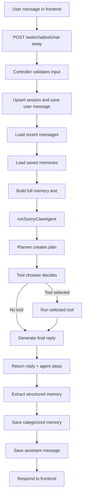

# sunny-claws

sunny-claws is a full-stack AI assistant project with a Next.js frontend and a Node/Express backend. It supports persistent chat sessions, categorized long-term memory, tool-augmented responses, and a planner-driven agent flow.

This document reflects the current implementation state of the repository.

## What It Can Do Now

- Chat end-to-end from frontend to backend.
- Store chat sessions and messages in MongoDB.
- Extract long-term memory from user messages as structured JSON.
- Store memory with categories (`identity`, `preference`, `project`, `skill`, `general`).
- Replace older identity memories (for example, name updates) with the newest one.
- Build a lightweight plan before tool selection/execution.
- Use multiple tools:
  - `calculator`
  - `weather`
  - `webSearch`
  - `email`
- Return resilient fallbacks when AI credentials or external services are unavailable.

## Architecture

- Backend: `Backend/`
- Frontend: `Frontend/claws/`

High-level behavior:

1. User sends a chat message from frontend.
2. Backend loads recent chat + saved memories.
3. Backend agent creates a plan.
4. Agent chooses and optionally executes a tool.
5. Assistant generates final reply with memory context and tool results.
6. Backend stores assistant reply and extracted memory.
7. Frontend renders response.

## Workflow Diagram

## Backend Request Flow

### Main endpoint

- `POST /web/chatbot/chat-away`

Execution flow in `chatbotController`:

1. Validate `message` and resolve `sessionId`.
2. Ensure session exists (`chatSessionModel`).
3. Save user message (`chatbotModel`).
4. Load recent chat history.
5. Load saved memories via `getMemories(sessionId)`.
6. Build memory context text.
7. Run `runSunnyClawAgent(cleanMessage, fullMemoryText)`.
8. Use `agentResult.reply` as assistant reply.
9. Extract structured memory (`extractMemory`).
10. Save memory object (`saveMemory`).
11. Save assistant message.
12. Return JSON reply.

Secondary endpoint:

- `GET /web/chatbot/sessions` returns sessions sorted by `updatedAt`.

## Key Capabilities Added

### 1) Planner-driven agent orchestration

- File: `Backend/services/agentService.js`
- File: `Backend/services/plannerService.js`

What happens:

- Agent first asks planner for a JSON plan.
- Planner failures gracefully fall back to a default simple plan.
- Agent records step results in `agentSteps`.
- Agent handles planning/tool/final-reply failures with try/catch fallbacks.

### 2) Structured, categorized memory

- File: `Backend/services/memoryService.js`
- File: `Backend/models/memoryModel.js`

What happens:

- Memory extraction returns JSON (`shouldSave`, `category`, `memory`).
- Name formats like `My name is ...`, `... is my name`, and `I am ...` are recognized.
- Memory schema now includes `category` (default `general`).
- For `identity` category, older identity memories for the session are replaced.
- Duplicate memory entries are avoided.

### 3) Expanded tool stack

- File: `Backend/tools/toolRegistry.js`

Active tools:

- `calculator`: math expressions.
- `weather`: weather lookup with known-city fallback coordinates + geocoding fallback.
- `webSearch`: DuckDuckGo instant answer lookup with timeout handling.
- `email`: SMTP email send using configured Gmail credentials.

### 4) Tool chooser improvements

- File: `Backend/services/openaiService.js`

What changed:

- Chooser prompt includes explicit web lookup rule.
- Chooser supports `webSearch` for latest/current facts and lookup-style queries.

## Tool Details

### Weather tool

- File: `Backend/tools/weatherTool.js`
- Fast path for known cities (Vancouver, Surrey, San Jose, Jalandhar).
- Supports typo handling like `vancovuer`.
- Uses abortable fetch timeouts for reliability.

### Web search tool

- File: `Backend/tools/webSearchTool.js`
- Uses DuckDuckGo Instant Answer API.
- Returns best available result from abstract, direct answer, or related topics.
- Includes timeout + error fallback behavior.

### Email tool

- File: `Backend/tools/emailTool.js`
- Validates `to`, `subject`, `body` input object.
- Reads Gmail email and app password from environment.
- Sends via secure Gmail SMTP host configuration.
- Includes temporary debug logs for delivery troubleshooting.

## File Map (Core)

### Backend

- `Backend/server.js`: app startup, middleware, route mount, DB connect.
- `Backend/routes/chatbotRouter.js`: chatbot route definitions.
- `Backend/controllers/chatbotController.js`: request orchestration.
- `Backend/services/openaiService.js`: tool chooser + final assistant generation.
- `Backend/services/agentService.js`: plan/tool/reply agent pipeline.
- `Backend/services/plannerService.js`: plan generation.
- `Backend/services/memoryService.js`: memory extraction/save/load.
- `Backend/services/toolService.js`: executes selected registry tool.
- `Backend/tools/toolRegistry.js`: tool registration.
- `Backend/tools/calculatorTool.js`: math tool.
- `Backend/tools/weatherTool.js`: weather tool.
- `Backend/tools/webSearchTool.js`: web lookup tool.
- `Backend/tools/emailTool.js`: email tool.
- `Backend/models/chatSessionModel.js`: sessions.
- `Backend/models/chatbotModel.js`: messages used by controller.
- `Backend/models/chatbotMessageModel.js`: duplicate message model definition (still present).
- `Backend/models/memoryModel.js`: categorized memories.

### Frontend

- `Frontend/claws/src/app/page.jsx`: welcome screen.
- `Frontend/claws/src/app/public/page.jsx`: chat UI and message send flow.
- `Frontend/claws/src/components/navbar.jsx`: shared top navigation.

## Environment Requirements (No Secrets)

Backend runtime expects environment variables for:

- Database connection
- AI API access
- Gmail sender address + app password (if using email tool)

Keep these in local env files and never commit secrets.

## Known Gaps / Work In Progress

- `Frontend/claws/src/app/private/` exists but is not implemented.
- Navbar profile/logout flows are not fully wired.
- `Backend/models/chatbotModel.js` and `Backend/models/chatbotMessageModel.js` are overlapping definitions.
- Controller currently includes temporary debugging logs (`TEMP agent steps`).

## Run Locally

### Backend

1. Install dependencies in `Backend/`.
2. Provide required local env variables.
3. Start server (for example with nodemon).

### Frontend

1. Install dependencies in `Frontend/claws/`.
2. Start Next.js dev server.
3. Open frontend and chat with backend running.

## Summary

sunny-claws now includes planner-assisted orchestration, categorized long-term memory, web lookup, weather fallback intelligence, and email sending in addition to the original chat + persistence flow.
